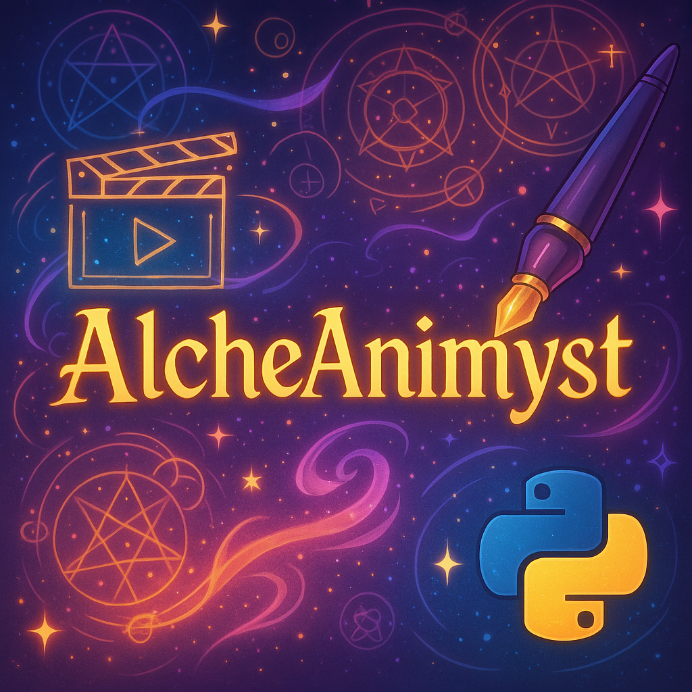
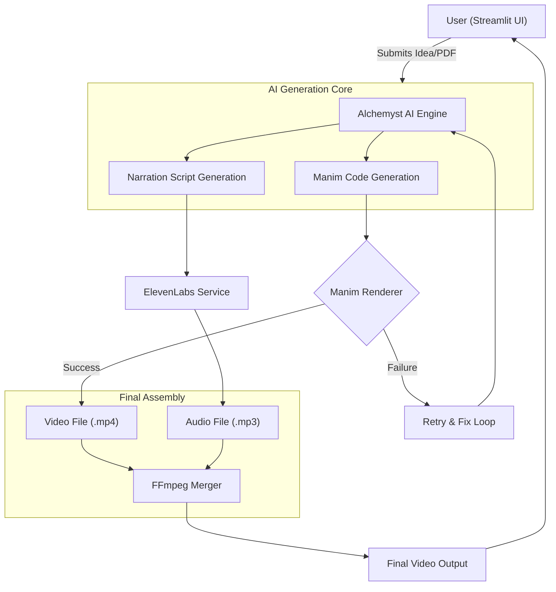

#  AlcheAnimyst

An AI-powered tool that transforms your text prompts or documents into stunning 2D animated videos, complete with narration, using Manim and Alchemyst AI.

---

## 📽️ Demo

<p align="center">
  <a href="https://youtu.be/mq-_jhjst5A" target="_blank">
    
  </a>
</p>

*A brief demonstration of the UI and a generated video.*

---

## 🚀 What is AlcheAnimyst?

AlcheAnimyst is an end-to-end video generation system. It takes a simple idea and orchestrates a multi-step AI and rendering pipeline to produce a finished, narrated animation.

- **Input:** A user submits a text-based idea (e.g., "Explain support vector machine algp").
- **Process:**
  1.  The **Alchemyst AI Engine** receives the prompt and generates two assets:
      - A Python script using the `Manim Community` library.
      - A corresponding narration script.
  2.  The **ElevenLabs Service** synthesizes the narration script into a high-quality voiceover audio file.
  3.  The **Manim Renderer** executes the generated Python script to create a silent animation.
  4.  A **Retry & Fix Loop** automatically detects rendering errors, sending the faulty code and error message back to Alchemyst AI for an automated fix.
  5.  Finally, `FFmpeg` merges the final video and audio tracks into a single, synchronized MP4 file.
- **Output:** A ready-to-watch `.mp4` video that visualizes the user's concept.

---


## 🛠️ Tech Stack

- **Frontend:** [Streamlit](https://streamlit.io/)
- **AI / LLM Provider:** [Alchemyst AI](https://getalchemystai.com/)
- **Animation Engine:** [Manim Community](https://www.manim.community/)
- **Text-to-Speech:** [ElevenLabs](https://elevenlabs.io/)
- **Core Logic:** Python, LangChain

---

## 🏗️ Architecture





*The user provides a prompt to the Streamlit UI. The Alchemyst AI engine generates Manim code and a narration script. The script is converted to audio by ElevenLabs, while the Manim code is rendered into a video. If rendering fails, a retry loop attempts to fix the code. Finally, the successful video and audio are merged and presented to the user.*

---

## 🌐 Key Links

- **LLM Provider:** [https://getalchemystai.com](https://getalchemystai.com)
- **Text-to-Speech:** [https://elevenlabs.io](https://elevenlabs.io)
- **Animation Framework:** [https://www.manim.community/](https://www.manim.community/)

---

## ⚡ Quickstart

### Prerequisites

- Python 3.9+
- **FFmpeg:** Manim and the video merger require FFmpeg. You must install it on your system.
  - **Windows (using Chocolatey):** `choco install ffmpeg`
  - **macOS (using Homebrew):** `brew install ffmpeg`
  - **Linux (Debian/Ubuntu):** `sudo apt update && sudo apt install ffmpeg`

### Installation

1.  **Clone the repo**
    ```bash
    git clone https://github.com/your-username/AlcheAnimyst.git
    cd AlcheAnimyst
    ```
2.  **Set up the environment**
    - Create a `.env` file in the root directory by copying the example:
      ```bash
      cp .env.example .env
      ```
    - Add your API keys to the `.env` file:
      ```env
      ALCHEMYST_API_KEY="sk-..."
      ELEVENLABS_API_KEY="..."
      ```
3.  **Install Python dependencies**
    ```bash
    pip install -r requirements.txt
    ```
4.  **Run the Streamlit App**
    ```bash
    streamlit run src/main.py
    ```
    The application will now be running and accessible in your web browser!

---

## 🔑 Get Your API Keys

This project requires API keys from two services:

1.  **Alchemyst AI:**
    - Sign up at [https://getalchemystai.com](https://getalchemystai.com).
    - Find your API key in your account dashboard.
    - Add it to your `.env` file as `ALCHEMYST_API_KEY`.

2.  **ElevenLabs:**
    - Sign up at [https://elevenlabs.io](https://elevenlabs.io).
    - Your API key can be found in your profile settings.
    - Add it to your `.env` file as `ELEVENLABS_API_KEY`.

---

## 🤖 How It Works: The AI Engine & Retry Loop

AlcheAnimyst's resilience comes from its smart generation and error-correction process.

-   **Code Generation (`engine/alchymist_ai.py`):** The core generation logic uses a highly detailed system prompt to guide Alchemyst AI. This prompt contains strict rules about using the modern Manim v0.19.0 API, ensuring the generated code is high-quality and avoids common pitfalls.

-   **Automated Error Correction (`engine/retry_loop.py`):** Manim code can sometimes fail. Instead of crashing, the app catches the `stderr` from the Manim process. It then packages the faulty code and the exact error message into a new prompt for Alchemyst AI, asking it to analyze and fix the problem. This allows the application to self-heal and successfully render videos that would have otherwise failed.

---

## 👥 Contributing

Contributions, issues, and feature requests are welcome! Feel free to check the [issues page](https://github.com/soumyacodes007/AlcheAnimyst).

---

## License

on my way 
